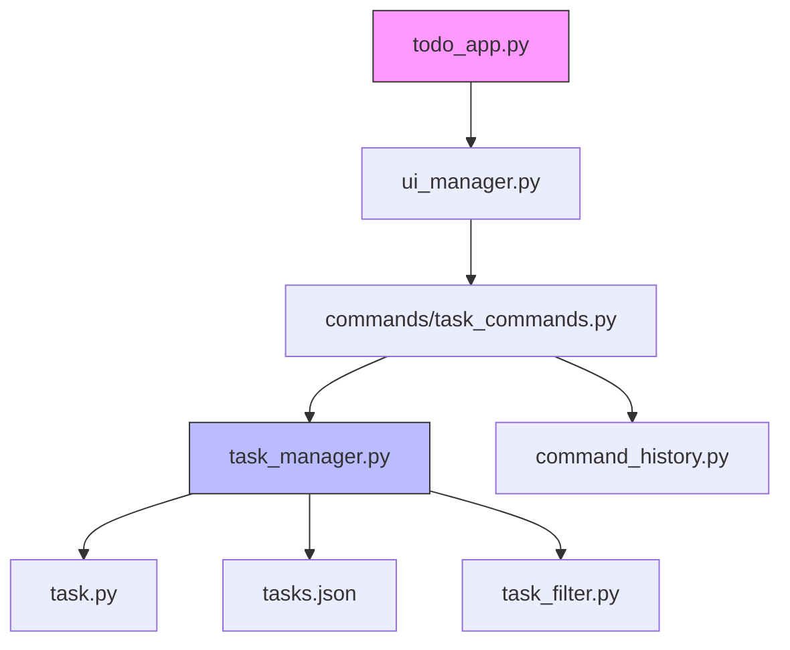
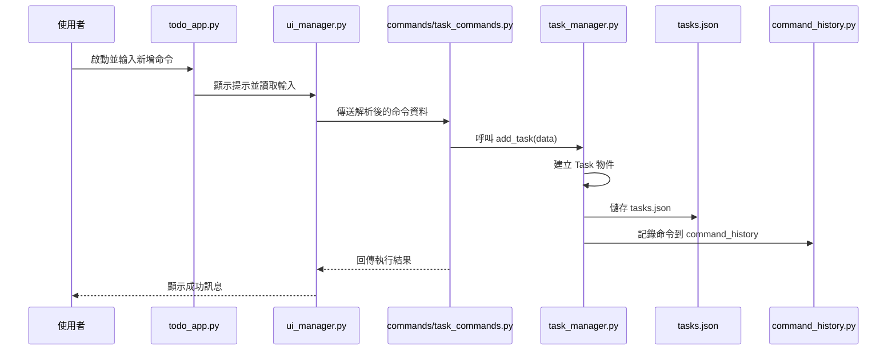

# 代辦 v9 — 專案概覽與現行技術架構

此專案為一個以模組化、MVVM 風格實作的代辦應用程式，主要分成：

- `task.py`: 任務資料模型（序列化/反序列化）。
- `task_manager.py`: 任務儲存、載入、匯出與檔案相關處理（支援可注入的 UI callback）。
- `viewmodel.py`: MVVM 的 ViewModel，集中業務邏輯（新增/刪除/更新/移動/完成切換等）。
- `ui_manager.py`: Tkinter UI 管理（顯示清單、處理使用者互動、發出命令）。
- `commands/`: 命令物件（`AddTaskCommand`, `UpdateTaskCommand`, 等），支援 undo/redo。
- `tests/`: 單元測試（目前包含 `test_viewmodel.py` 與 smoke 測試）。

近期主要改動與設計決策
- `Task.from_dict` 增強：反序列化時更寬容地處理 `due_date` 與 `creation_time`（優先解析 `date`，再 fallback 為 `datetime`），減少資料格式差異導致錯誤的機率。
- `TaskManager` 支援注入 `UI` callback（`UIFallback` / `DefaultUI`），讓資料層在 headless 或測試環境不依賴 tkinter 直接顯示對話框。
- `TodoApp` 啟動時會把 `UIManager` 注入 `TaskManager`，使訊息顯示統一由 UI 處理。
- `UIManager` 修正 Treeview 欄位對應（`#0` 主欄、`#1` 優先級、`#2` 截止日期），並改進了一些錯誤處理以提升穩定性。

未提及但已實作的功能（補充）
- 任務索引最佳化：`ViewModel` 維護 `task_id -> task` 與 `task_id -> parent_id` 索引，加速查詢並在結構變動後重建索引。
- 父子完成狀態聯動：父項標示完成會遞迴完成子孫；任一子項改為未完成會往上解除父層完成狀態。
- 防呆拖放：禁止將父項拖入其子孫；拖放支援「成為子項 / 同層前後插入 / 透過水平位移提升層級」。
- UI 展開狀態保留：重繪 Tree 時會記住並還原展開節點，避免操作後自動折疊。
- 進階欄位：除文字、連結、優先級、截止日外，已支援 `project` 與 `start_date`，並做開始/截止日期邏輯驗證。
- 連結互動：可從右鍵選單開啟/移除連結，也可直接點擊文字欄位開啟連結。
- 主題與偏好：支援明暗主題切換，並將 `dark_mode` 持久化到 `config.json`。
- 搜尋與篩選：支援關鍵字搜尋高亮、全部/未完成/高優先/已完成篩選，並保留階層脈絡。
- Markdown 匯出細節：匯出時子項會繼承父項完成狀態，輸出為核取方塊清單（含連結語法）。
- 檔案健壯性：`TaskManager` 會將相對路徑解析為模組絕對路徑；JSON 損毀時自動備份為 `.bak`。
- 操作歷史控制：Undo/Redo 採命令逆向操作，並限制最大歷史步數（50）避免記憶體膨脹。
- 快捷鍵與互動：支援 `Ctrl+Z`、`Ctrl+Y`、`Delete`、右鍵選單、雙擊編輯與拖放門檻判斷。
- 資料時間一致性：`Task` 的 `creation_time` 以 UTC 序列化/反序列化，降低跨時區資料偏差。

如何執行（建議）
1. 建議建立虛擬環境並安裝依賴：

```powershell
python -m venv .venv
. .venv\Scripts\Activate.ps1   # PowerShell
pip install -r requirements.txt
```

2. 執行測試：

```powershell
python -m pytest -q
```

3. 啟動 GUI 應用：

```powershell
python todo_app.py
```

持續整合（CI）

專案包含範例 GitHub Actions workflow（`.github/workflows/python-app.yml`），會在 push/PR 時執行 `pytest`。

貢獻與下一步建議
- 為 `commands` 的 undo/redo 補強測試與 logging。
- 擴充 `tests/` 以覆蓋 `task_manager` 的儲存/讀取/匯出行為。
- 若需端到端 GUI 測試，可考慮採用 Playwright 或 PyAutoGUI。

---

檔案清單快速連結
- [todo_app.py](todo_app.py)
- [ui_manager.py](ui_manager.py)
- [viewmodel.py](viewmodel.py)
- [task_manager.py](task_manager.py)
- [task.py](task.py)
- [task_filter.py](task_filter.py)
- [commands/base_command.py](commands/base_command.py)
- [commands/task_commands.py](commands/task_commands.py)
# 代辦 v8 修復子清單 — 專案概覽

本檔案以 Markdown 概覽此專案結構、主要模組責任與使用方式，並以 Mermaid 圖說明元件架構與主要流程。

**簡短描述**

一個以模組化方式實作的命令式代辦清單應用，主要負責：任務資料模型、任務管理邏輯、UI 管理、命令解析與操作歷史記錄。

**專案檔案（概要）**

- **`todo_app.py`**: 專案入口，啟動應用與主事件迴圈。
- **`ui_manager.py`**: 負責與使用者互動的介面層（輸入/輸出、顯示清單等）。
- **`task_manager.py`**: 任務主要業務邏輯（新增/刪除/更新/查詢/儲存）。
- **`task.py`**: 任務資料模型（Task 類別、序列化/反序列化）。
- **`task_filter.py`**: 任務過濾與搜尋邏輯（依標籤、狀態、關鍵字等）。
- **`command_history.py`**: 記錄使用者的命令歷史（可做還原/重做功能）。
- **`tasks.json`**: 任務資料的磁碟儲存檔（JSON）。
- **`commands/`**: 命令相關模組集合。
  - **`commands/base_command.py`**: 命令基底類別與共同介面。
  - **`commands/task_commands.py`**: 與任務相關的具體命令實作（新增/完成/刪除/列出等）。

檢視原始檔案：

- [todo_app.py](todo_app.py)
- [ui_manager.py](ui_manager.py)
- [task_manager.py](task_manager.py)
- [task.py](task.py)
- [task_filter.py](task_filter.py)
- [command_history.py](command_history.py)
- [tasks.json](tasks.json)
- [commands/base_command.py](commands/base_command.py)
- [commands/task_commands.py](commands/task_commands.py)

**主要責任與互動（簡述）**

- `todo_app.py`: 啟動並注入各模組依賴（UI、TaskManager、CommandRegistry）。
- `ui_manager.py`: 顯示清單、讀取使用者輸入，將使用者動作轉換成命令呼叫。
- `commands/*`: 解析並執行具體動作，呼叫 `task_manager.py` 完成業務邏輯。
- `task_manager.py`: 管理記憶體中的任務集合，並負責序列化到 `tasks.json`。
- `command_history.py`: 保存每次已執行命令的摘要，用於查詢或還原。

**MVVM 重構說明（新增）**

本專案已由傳統 Controller-style 漸進重構為 MVVM（Model-View-ViewModel）：

- **`viewmodel.py`**: 新增的檔案，作為 ViewModel 層，負責協調 `TaskManager`、命令歷史 (`CommandHistory`)、以及提供 UI 可呼叫的 API（新增/刪除/更新/移動/切換完成/移除連結等）。
- `UIManager` 現在注入並呼叫 `ViewModel`（而不是直接操作 `TaskManager` 或 tasks 結構），命令也改為使用 `ViewModel` 的公開方法，使業務邏輯集中且可測試。

這次重構保持現有命令物件模型（`commands/*`），但命令實作已變薄：它們現在主要負責保存 `state_backup` 與呼叫 `ViewModel` API。

**ViewModel — 主要 API（摘要）**

- `add_task(task_text: str)`：新增任務。
- `delete_tasks(task_ids: List[str])`：刪除多個任務。
- `update_task(task_id: str, new_text: Optional[str], new_link: Optional[str], new_priority: str, new_due_date: Optional[date], new_is_done: Optional[bool])`：更新任務欄位。
- `toggle_done(task_ids: List[str])`：切換完成狀態（會遞迴標記子項）。
- `remove_link(task_id: str)`：移除任務連結。
- `move_task(task_id: str, target_id: Optional[str], y: Optional[int], bbox: Optional[tuple], delta_x: Optional[int])`：在樹狀結構內移動任務（保留原先拖放邏輯）。
- `snapshot_state()`：取得 `tasks` 的深拷貝，用於命令的 undo。

因為業務邏輯集中在 `ViewModel`，我們能更容易以非 GUI 的方式測試關鍵行為。

**如何在不開 GUI 的情況下執行快速測試（Smoke test）**

專案內已加入一個簡單的 smoke 測試：`tests/run_smoke.py`。它使用 `ViewModel` 與現有的 `commands` 執行：新增、更新、切換完成、移除連結、刪除，並在終端列印任務快照。

執行方式（Windows PowerShell）：

```powershell
python tests\run_smoke.py
```

你應會看到每個步驟的任務快照輸出，確認 ViewModel 與命令整合運作正常。

**測試覆蓋建議**

- 建議新增 `pytest` 測試套件，覆蓋 `viewmodel` 的新增/刪除/更新/移動/匯出行為。`tests/run_smoke.py` 可作為範例。
- 若要更乾淨的架構，可將 `commands` 進一步薄化為只負責 UI 事件到 `ViewModel` API 的轉換，或把 `Command` 類別替換為更簡潔的 action pattern。

---

若你要我：
- 我可將 `commands` 的 undo/redo 進一步檢查並新增測試，或
- 幫你建立 `pytest` 測試範例並加入 GitHub Actions CI，或
- 自動化 GUI 操作以執行端到端測試（需要額外的 GUI 自動化工具，例如 PyAutoGUI 或 Playwright）。


**如何執行（開發環境）**

在有 Python 環境的情況下（Windows 範例）：

```powershell
python todo_app.py
```

應用會啟動互動式介面（CLI）；具體可用的命令或參數請參考 `commands/task_commands.py`。

**架構圖（Mermaid）**

下面為高階元件互動圖：



**範例流程圖：新增任務（Sequence）**



**開發建議 / 下一步**

- 若需單元測試：新增 `tests/`，針對 `task_manager.py`、`task_filter.py` 編寫測試。
- 若需 CLI 指令文件：補一份 `USAGE.md` 或在 `README.md` 中補充常用命令範例。

---

若要我把這個 README 寫成專案內的檔案（已完成）、或幫你擴充命令參考和測試範例，告訴我要優先哪一項即可。
